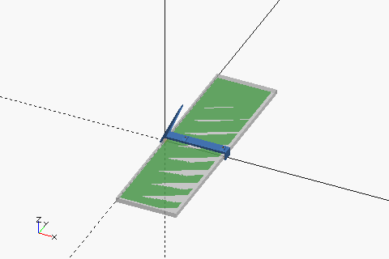

# LandscaPi
A tiny Linux-based digital signage on your desktop.

<p align="center">
  
</p>
<p align="center">
  
</p>

## Components


### BOM
| Name                                           | Quantity | Typ. price (USD) | Notes                                                               |
| ---------------------------------------------- | :------: | ---------------- | ------------------------------------------------------------------- |
| 8.8 inch 1920x480 LCD with driver (HSD088IPW1) |    1     | 66               | [Aliexpress](https://www.aliexpress.com/item/1005001479844594.html) |
| Orange Pi Zero plus 2 (H5 model)               |    1     | 20~40?           |                                                                     |
| 40 pin, 5 cm FFC                               |    1     | 0.5              | [Aliexpress](https://www.aliexpress.com/item/33063315583.html)      |
| HDMI-miniHDMI adapter                          |    1     | -                | [HDMI-A2C](https://github.com/likeablob/HDMI-A2C)                   |
| M2*5 Tap screw                                 |    7     | -                |                                                                     |
| Dupont wire                                    |    2     | -                |                                                                     |

### 3D-printable parts
|                                                   | STL                                                              |
| ------------------------------------------------- | ---------------------------------------------------------------- |
|      | [landscapi_stand_65deg.stl](./landscapi_stand_65deg.stl)         |
|      | [landscapi_stand_75deg.stl](./landscapi_stand_75deg.stl)         |
|       | [landscapi_opiz_mount.stl](./landscapi_opiz_mount.stl)           |
|  | [landscapi_lcd_driver_shim.stl](./landscapi_lcd_driver_shim.stl) |


## Installation
WIP
1. Setup [armbian](https://www.armbian.com/) for your SBC.
1. Install x11, chromium, nodm, mpv, etc.
    ```sh
    sudo apt update && sudo apt install -y -q \
        chromium-browser \
        matchbox-window-manager \
        nodm \
        xserver-xorg-input-libinput \
        xserver-xorg-video-fbdev \
        x11-apps \
        xinit \
        xfonts-base \
        xloadimage \
        x11vnc \
        tmux \
        mpv
    ```

## License
MIT

## Related projects
- [HDMI-A2C](https://github.com/likeablob/HDMI-A2C)
